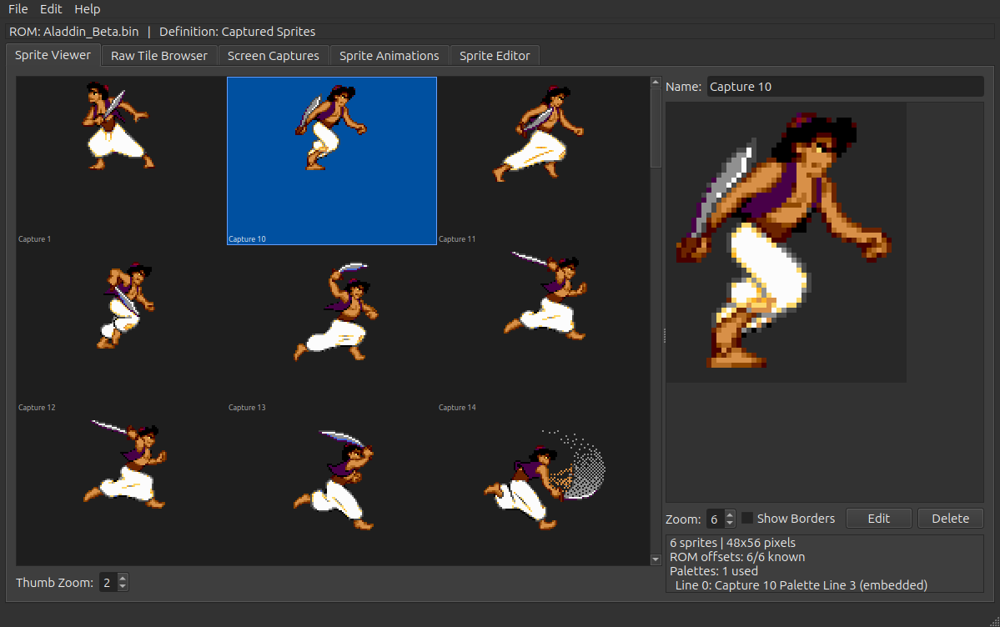

# genesis-hacking

AI-assisted tools for Sega Genesis / Megadrive ROM hacking. The main deliverables are a sprite editor for viewing and replacing artwork, and a customized BlastEm emulator with enhanced debugging for reverse engineering.

## Tools

### Sprite Editor (`sprite-editor/`)

A Qt6/C++ application for viewing, editing, and replacing sprite artwork in Genesis ROMs. Sprite locations are described by a JSON game definition file, making the tool usable with any game.



**Features:**
- **Sprite Viewer** — browse sprite groups with drag-to-reorder, independent thumbnail zoom, palette-colored border overlays, double-click to jump to Raw Tile Browser
- **Raw Tile Browser** — explore raw tile data anywhere in ROM, assemble tiles into sprites, jump to offset
- **Screen Captures** — display full-screen tile maps captured from BlastEm, with hover tile info, status bar showing pattern/palette recovery stats, and pixel-level tile editing with shared tile highlighting
- **Sprite Editor** — pixel-level painting with pencil, bucket fill, eyedropper, and adjustable brush tools in a 2x2 icon grid, with 4x4 palette selector and 1x16 palette strip
- **Sprite Animations** — load and browse `.sprec` sprite recording files captured from BlastEm, capture sprite groups from animation frames
- Multi-palette support, Nemesis/Kosinski decompression, PNG export, original ROM overwrite protection

**Build:** Requires `qt6-base-dev`. Run `cd sprite-editor && bash build.sh`.

**Usage:**
```
./build/SpriteEditor [rom.bin] [definition.json] [recording.sprec ...]
```

**Example (Aladdin):**
```
./build/SpriteEditor roms/Aladdin_Beta.bin sprite-editor/examples/aladdin_sprite_def.json sprite-editor/examples/ali_animations.sprec
```

See [sprite-editor/docs/USAGE.md](sprite-editor/docs/USAGE.md) for the full user guide.

### BlastEm (forked, at `../blastem/`)

Forked BlastEm Genesis emulator with ROM hacking enhancements:

- **DMA history tracking** — ring buffer records all VDP DMA transfers with source/destination addresses, enabling tracing of tile and palette data back to ROM
- **`dmatrace` command** — log all DMA transfers to a file for analysis
- **`screencap` command** — capture the full VDP tile map to JSON for the sprite editor, with ROM offset resolution via DMA history and brute-force ROM search
- **Read watchpoints** — break when emulated code reads from specific addresses
- **`--dma-history N`** — configure DMA history buffer size

Enter the debugger during emulation by pressing backtick. Run `help` to see all commands.

### bn-genesis (`../bn-genesis/`)

Binary Ninja plugin for Genesis ROM analysis. Parses ROM headers, maps memory segments, decodes VDP register writes, and provides M68K assembly patching.

## ROM Analysis

### Aladdin (`sprite-editor/examples/aladdin_sprite_def.json`)

Target ROM: Aladdin Beta (Aladdin_Beta.bin).

- Game definition file with sprite groups, palettes, and pattern pools
- Animation recording (`ali_animations.sprec`) — captured sprite animation frames from BlastEm
- Screen captures of title screen and market level (`aladdin_title_screencap.json`, `aladdin_market_screencap.json`)

### Moonwalker (`sprite-editor/examples/moonwalker.json`)

Target ROM: Michael Jackson's Moonwalker (USA, JUE, checksum 0x38B2).

- Primary sprite bank: 0x01B000-0x02A400 (~1952 tiles)
- Confirmed sprite groups: MJ animations at 0x0220E0 (2x4), 0x023800 (2x5), 0x0290A0 (3x5)
- MJ Gray Suit palette at 0x0082CA
- Tile data is identical across ROM revisions; palette offsets differ

## Project Structure

```
genesis-hacking/
  sprite-editor/       Qt6/C++ sprite editor
    examples/          Game definition JSON files
    docs/              User guide and screenshots
  docs/                Genesis hardware documentation
  tools/               BlastEm trace analysis scripts
  roms/                ROM files (gitignored)
```

## Documentation

- [Sprite Editor User Guide](sprite-editor/docs/USAGE.md) — full guide with screenshots
- [PLANNING.md](PLANNING.md) — development history and roadmap
- `docs/genvdp-charles-macdonald.txt` — authoritative VDP/tile/CRAM reference
