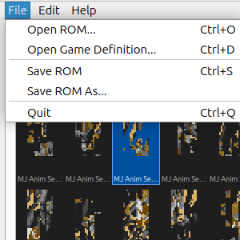
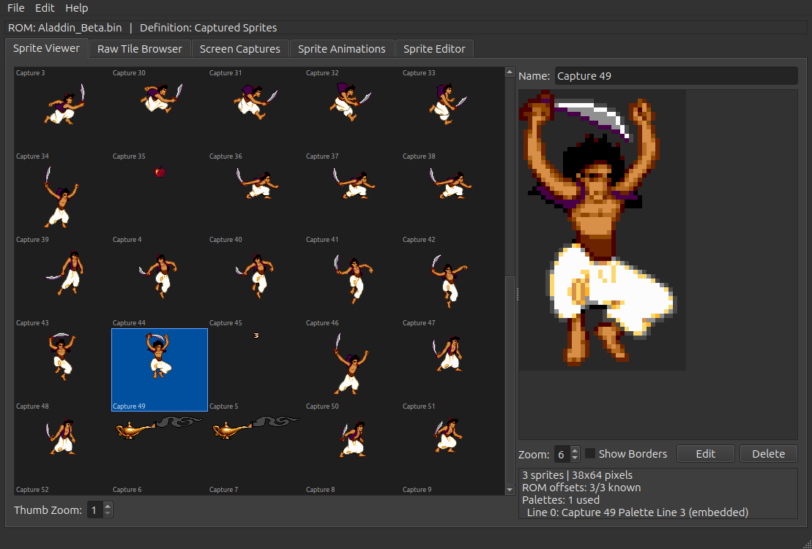
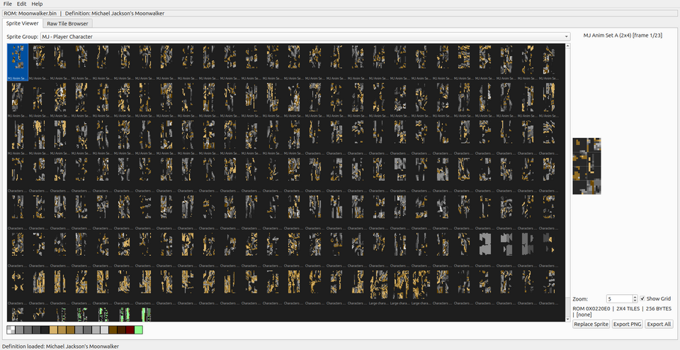
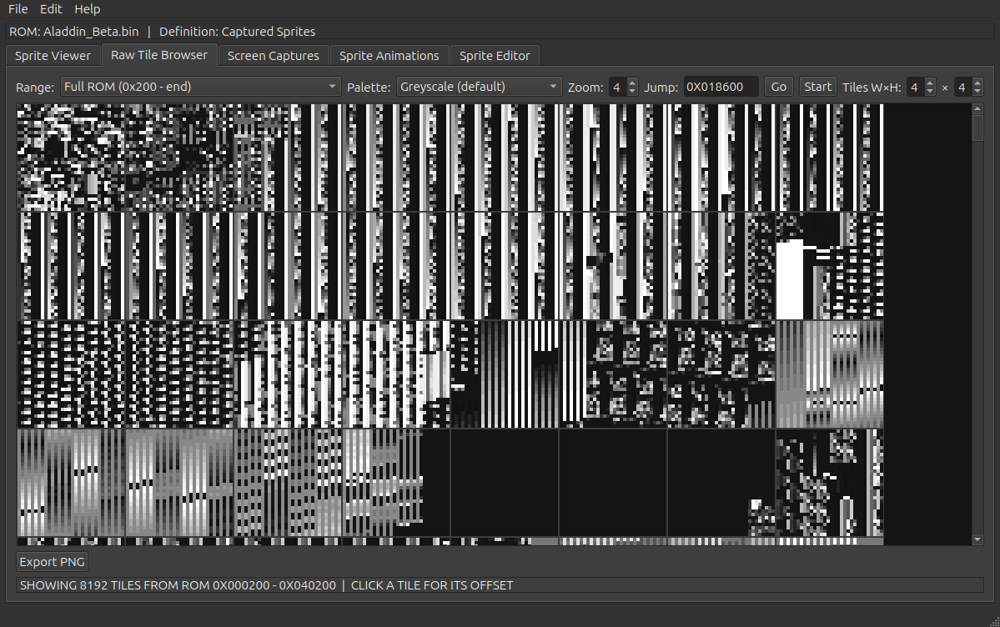
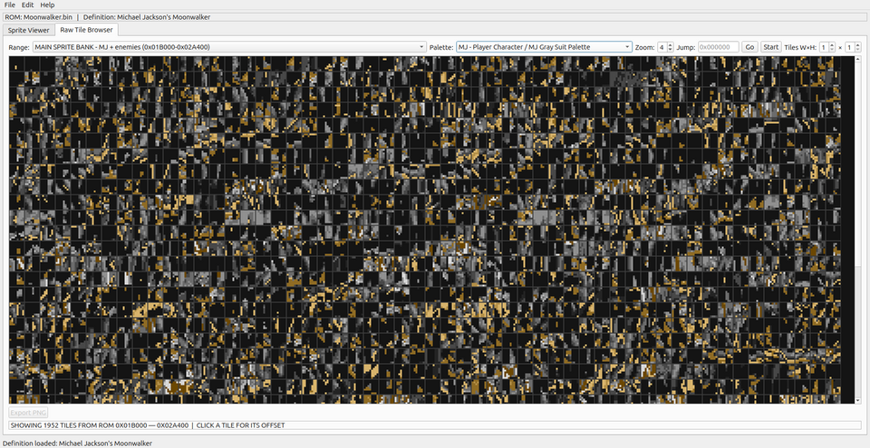
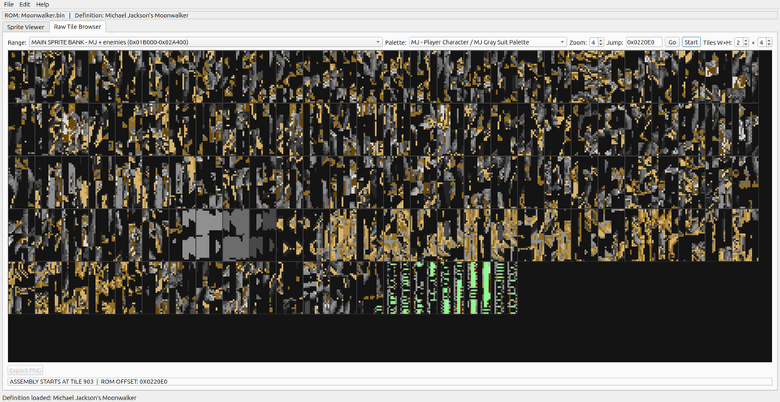
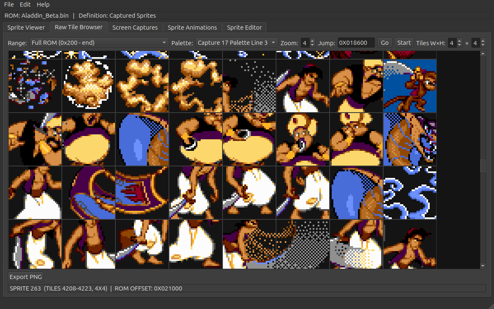

# Genesis Sprite Editor - User Guide

A Qt6/C++ tool for viewing, exporting, and replacing sprite artwork in Sega Genesis / Megadrive ROMs. Sprite locations are described by a JSON game definition file, making the tool usable with any Genesis game.

## Building

Requires Qt6 development libraries (`qt6-base-dev` or equivalent).

```bash
cd sprite-editor
bash build.sh
```

The binary is output to `sprite-editor/build/SpriteEditor`.

## Quick Start

Launch with command-line arguments to skip the file dialogs:

```bash
./build/SpriteEditor path/to/rom.bin path/to/definition.json
```

File type is auto-detected: `.json` files are loaded as game definitions, everything else as a ROM. Both arguments are optional and can be in any order.

You can also open files from within the app using **File > Open ROM** (`Ctrl+O`) and **File > Open Game Definition** (`Ctrl+D`).



## Sprite Viewer Tab

The Sprite Viewer displays all sprites defined in the JSON game definition, organized by groups.

### Browsing Sprites

1. Load a ROM and game definition (via File menu or command line)
2. Select a sprite group from the **Sprite Group** dropdown
3. All sprites in the group appear as thumbnails in the scrollable grid
4. The palette bar at the bottom shows the 16 colors used by the current group



### Viewing Sprite Details

Click any thumbnail to select it. The right panel shows:

- **Sprite name** and frame number (for multi-frame entries)
- **Zoomed preview** of the sprite with optional tile grid overlay
- **ROM offset**, tile dimensions, byte size, and compression type
- **Palette** used for this sprite

Use the **Zoom** spinbox and **Show Grid** checkbox to adjust the detail view.



### Exporting Sprites

- **Export PNG** - Save the currently selected sprite as a PNG file
- **Export All** - Batch-export every frame in the current sprite group to a directory. Multi-frame entries get numbered suffixes (`_000.png`, `_001.png`, etc.)

### Replacing Sprites

1. Select a sprite in the grid
2. Click **Replace Sprite** (or **Edit > Replace Sprite...**)
3. Browse for a PNG image. It will be scaled to match the sprite dimensions if needed
4. The preview shows exactly what will be written to the ROM (quantized to the 16-color palette)
5. Click OK to write the replacement into the ROM
6. Use **File > Save ROM** (`Ctrl+S`) to save changes

Only uncompressed sprites can be replaced directly. For compressed sprites, locate the uncompressed tile data in the Raw Tile Browser and update the JSON definition accordingly.

## Raw Tile Browser Tab

The Raw Tile Browser lets you explore raw 8x8 tile data anywhere in the ROM. This is the primary tool for discovering sprite locations in games that don't have a definition file yet.

### Basic Browsing



- **Range** - Select a ROM address range to browse. If a game definition is loaded, it provides named ranges; otherwise a default "Full ROM" range is used.
- **Palette** - Choose between greyscale (default) or any palette from the game definition.
- **Zoom** - Adjust tile display size.

### Applying a Palette

Selecting a palette from the dropdown immediately re-renders all tiles with those colors, making sprite data much easier to identify visually.



### Assembling Tiles into Sprites

Genesis sprites are composed of multiple 8x8 tiles arranged in a grid. Use the **Tiles W x H** spinboxes to group tiles into assembled sprites:

1. Set **W** and **H** to the sprite dimensions in tiles (e.g., 2x4 for a 16x32 pixel sprite)
2. Enter the starting ROM offset in the **Jump** field (hex, e.g., `0x0220E0`)
3. Click **Start** to set that offset as the assembly origin

The tiles are assembled in Genesis column-major order: tile at (col, row) = col * height + row.



### Getting Tile Information

Click any tile or assembled sprite to see its ROM offset in the status bar. This is essential for building game definition files.



### Exporting from Raw Browser

Click a tile or sprite, then click **Export PNG** to save it as a PNG file using the currently selected palette.

## Screen Captures Tab

The Screen Captures tab displays full-screen tile maps captured from BlastEm using the `screencap` debugger command. This lets you see exactly what the Genesis is rendering and trace every tile back to its ROM location.

### Capturing a Screen

1. Run your ROM in BlastEm with the debugger: `blastem -d rom.bin`
2. Play until the desired screen (e.g., title screen)
3. Enter the debugger (press backtick)
4. Run: `screencap title.json` (or `screencap title.json b` for Plane B)
5. Load the resulting JSON in the sprite editor as a game definition

### Viewing Screen Captures

1. Load the captured JSON file via **File > Open Game Definition**
2. Switch to the **Screen Captures** tab
3. Select a capture from the dropdown (if the file contains multiple)
4. Use the **Zoom** spinbox to adjust the display scale (1x-8x)
5. Hover over any tile to see its details: pattern index, palette line, flip flags, ROM offset, and source type

### Tile Source Types

Each tile in the capture has a source indicating how its ROM location was found:

| Source | Meaning |
|--------|---------|
| `dma` | ROM offset found via DMA transfer history (most reliable) |
| `search` | ROM offset found by brute-force search of tile data in ROM |
| `embedded` | Tile not found in ROM; raw data is embedded in the JSON |
| `blank` | Tile is all zeros (empty/transparent) |

### Optionally Loading a ROM

If you also load the corresponding ROM file, the editor reads tile data directly from ROM offsets. Without a ROM, only embedded tiles and blank tiles will display correctly.

## Game Definition JSON Format

A game definition file tells the editor where sprites and palettes are located in a specific ROM. Here is the schema:

```json
{
  "game_name": "Game Title",
  "game_id": "game_id",

  "sprite_groups": [
    {
      "name": "Group Name",
      "palettes": [
        {
          "name": "Palette Name",
          "rom_offset": "0x008000"
        }
      ],
      "sprites": [
        {
          "name": "Sprite Name",
          "rom_offset": "0x020000",
          "width_tiles": 2,
          "height_tiles": 4,
          "frame_count": 23,
          "palette_index": 0,
          "compression": "none",
          "notes": "Optional description"
        }
      ]
    }
  ],

  "tile_ranges": [
    {
      "label": "Main Sprite Bank (0x1B000-0x2A400)",
      "start_offset": "0x01B000",
      "end_offset": "0x02A400",
      "default_palette_group": 0
    }
  ]
}
```

### Field Reference

**sprite_groups[]**

| Field | Description |
|-------|-------------|
| `name` | Display name for the group |
| `palettes[]` | Array of palette definitions (16-color, 32 bytes each at `rom_offset`) |
| `sprites[]` | Array of sprite entries |

**sprites[]**

| Field | Type | Default | Description |
|-------|------|---------|-------------|
| `name` | string | required | Display name |
| `rom_offset` | hex string | required | ROM file offset (e.g., `"0x0220E0"`) |
| `width_tiles` | int | 1 | Width in 8px tiles (1-8) |
| `height_tiles` | int | 1 | Height in 8px tiles (1-8) |
| `frame_count` | int | 1 | Number of consecutive frames at this offset |
| `palette_index` | int | 0 | Index into the parent group's `palettes` array |
| `compression` | string | `"none"` | `"none"`, `"nemesis"`, or `"kosinski"` |
| `notes` | string | `""` | Optional notes (not displayed in UI) |

When `frame_count` > 1, the editor treats the data at `rom_offset` as N consecutive sprites of the same dimensions, each `width_tiles * height_tiles * 32` bytes apart.

**tile_ranges[]**

| Field | Type | Default | Description |
|-------|------|---------|-------------|
| `label` | string | required | Display name in the Range dropdown |
| `start_offset` | hex string | `"0x200"` | Start of browsable range |
| `end_offset` | hex string | `"0x80000"` | End of browsable range |
| `default_palette_group` | int | -1 | Sprite group index for auto-palette selection |

**screen_captures[]** (optional, generated by BlastEm `screencap` command)

```json
"screen_captures": [
  {
    "name": "title_screen",
    "width_tiles": 40,
    "height_tiles": 28,
    "palettes": [
      { "line": 0, "cram_values": ["0EEE", "0E80", ...], "dma_source": "0x1A200" },
      { "line": 1, "cram_values": [...], "dma_source": null }
    ],
    "tile_map": [
      {
        "row": 0, "col": 0, "pattern": 145, "palette_line": 2,
        "h_flip": false, "v_flip": false, "priority": false,
        "rom_offset": "0x1B240", "source": "dma"
      }
    ],
    "embedded_tiles": {
      "0x1234": "AABBCCDD..."
    }
  }
]
```

| Field | Description |
|-------|-------------|
| `name` | Capture identifier |
| `width_tiles` / `height_tiles` | Visible dimensions (typically 40x28 NTSC, 40x30 PAL) |
| `palettes[]` | All 4 CRAM palette lines: `line` (0-3), `cram_values` (16 hex color words), `dma_source` (ROM offset or null) |
| `tile_map[]` | One entry per visible tile: `row`, `col`, `pattern` (VDP tile index), `palette_line`, `h_flip`, `v_flip`, `priority`, `rom_offset` (hex or null), `source` (`dma`/`search`/`embedded`/`blank`) |
| `embedded_tiles` | Hex-encoded 32-byte tile data keyed by VRAM address, for tiles not found in ROM |

See `examples/moonwalker.json` for a complete working example.

### Normalized Format

The normalized format uses shared palette and pattern pools referenced by ID,
rather than duplicating data in each sprite group:

```json
{
  "game_name": "Game Title",
  "game_id": "game_id",
  "palettes": {
    "pal_id": {
      "name": "Palette Name",
      "rom_offset": "0x8000",
      "cram_values": ["0x0000", "0x0eee", ...]
    }
  },
  "patterns": {
    "pat_id": {
      "name": "Pattern Name",
      "rom_offset": "0x20000",
      "width_tiles": 2,
      "height_tiles": 4,
      "frame_count": 1,
      "compression": "none"
    }
  },
  "sprite_collections": {
    "col_id": {
      "name": "Collection Name",
      "sprites": [
        {
          "pattern": "pat_id",
          "palette": "pal_id",
          "x": 0, "y": 0,
          "h_flip": false, "v_flip": false
        }
      ]
    }
  }
}
```

## Sprite Recording Workflow (.sprec files)

Sprite recordings capture hardware sprite data across multiple frames from
BlastEm's debugger, allowing frame-by-frame analysis of game animations.

### Recording Sprites in BlastEm

1. Run your ROM in BlastEm with the debugger: `blastem -d rom.bin`
2. Play until the sprites you want to capture are on screen
3. Enter the debugger (press backtick)
4. Run: `spritecap output.sprec` to start recording sprite data
5. Resume the game to capture frames, then stop recording in the debugger

### Loading Recordings

```bash
./build/SpriteEditor rom.bin definition.json recording.sprec
```

Or use **File > Open Game Definition** and select a `.sprec` file.
Recordings appear in the **Sprite Collections** tab with a "Recording:" prefix
and a frame navigation spinbox.

### Aladdin Example Walkthrough

The `examples/` directory includes Aladdin sample files:
- `aladdin_spriterecord.sprec` — multi-frame sprite recording
- `aladdin_market_screencap.json` — market scene screen capture
- `aladdin_title_screencap.json` — title screen capture

To explore:
```bash
./build/SpriteEditor aladdin.bin examples/aladdin_spriterecord.sprec
```

## Multi-Select and Capture Workflow

The Sprite Collections tab supports multi-select for identifying and
capturing sprite groups from recordings.

### Multi-Select

- **Click** a sprite to select it (opens in pixel editor)
- **Ctrl+Click** to toggle additional sprites in/out of the selection
- **Rubber-band drag** on empty space to select all sprites in a rectangle
- **Ctrl+rubber-band** adds to existing selection

The selection label below the controls shows how many sprites are selected.

### Capturing Sprite Groups

After selecting sprites that form a character or object:

1. Click **Capture Sprite Group**
2. Enter a name for the group (e.g., "Aladdin Walk Frame 1")
3. The editor creates palette pool entries, pattern pool entries, and a
   normalized sprite collection in the game definition JSON
4. The game definition is auto-saved

Sprite positions are normalized relative to the group's bounding box origin.

### Hide/Unhide Sprites

After capturing a group, you can hide those sprites to reduce visual
clutter when analyzing subsequent frames:

- **Hide Selected** — removes selected sprites from rendering (they still
  appear as dashed outlines when hovered or selected)
- **Unhide All** — restores all hidden sprites

Hidden state resets when changing frames or collections.

## Composite Sprite Editor

When clicking a multi-sprite normalized collection in the Collections tab,
the pixel editor opens in **group mode**:

- All sprites are composited at their correct positions
- Painting works across sprite boundaries — the editor automatically
  determines which sprite owns each pixel
- Dashed yellow outlines show individual sprite boundaries
- **Save Tiles to ROM** writes each sprite's modified tile data to its
  own ROM offset

This is essential for editing characters that span multiple hardware sprites.

## Genesis Tile Format Reference

- **Tile size**: 8x8 pixels, 4 bits per pixel = 32 bytes per tile
- **Pixel encoding**: Each byte contains 2 pixels (high nibble = left pixel, low nibble = right pixel)
- **Palette index 0**: Transparent in sprites
- **CRAM palette format**: 16 colors per palette, 2 bytes each (big-endian): `---- bbb- ggg- rrr-` (3 bits per channel, values 0-7 mapped to 0-252 brightness)
- **Sprite tile order**: Column-major. For a W x H sprite, tile at column `c`, row `r` is stored at index `c * H + r`
- **ROM storage**: Tiles are stored as a contiguous byte stream. A 2x4 sprite = 8 tiles = 256 bytes

## Keyboard Shortcuts

| Shortcut | Action |
|----------|--------|
| `Ctrl+O` | Open ROM |
| `Ctrl+D` | Open Game Definition |
| `Ctrl+S` | Save ROM |
| `Ctrl+Q` | Quit |
| Arrow keys | Navigate sprite grid (Sprite Viewer) |
| Home / End | Jump to first / last sprite |
